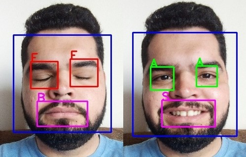
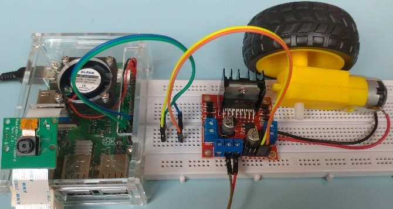
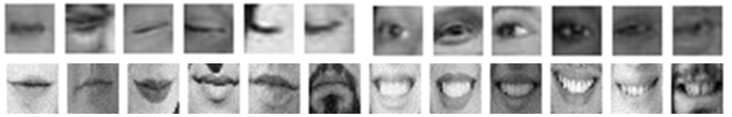

# Reconhecimento de expressão facial com RaspBerry
Repositório criado com a finalidade de compartilhar os códigos desenvolvidos durante o meu trabalho de conclusão de curso (Engenharia da Computação) intitulado "**Acionamento direcional motor através de reconhecimento de expressões faciais**".

## Objetivo
O objetivo desse trabalho foi implementar o reconhecimento de expressões faciais, em tempo real, utilizando visão computacional, para controlar um motor de corrente contínua. Sendo um protótipo inicial de avaliação que, futuramente, poderá ser projetado para auxiliar no controle de cadeira de rodas, para pessoas que não são capazes de aciona-la de modo convencional.

## Funcionamento
Para a localização das regiões de interesse na face, foi utilizado o algoritmo de Viola-Jones, que permite a detecção em tempo real devido ao seu baixo custo computacional. Para realizar as classificações das expressões (olhos fechados, sorriso), foram treinados dois modelos de redes neurais convolucionais

## Protótipo
Foi montado um protótipo constituído de: mini câmera de 5MP para aquisição das imagens; Raspberry Pi 3 B+ para processamento e classificação das imagens; módulo Ponte H L298N para auxiliar no controle direcional do motor e um motor de corrente contínua. 

## Treinamento

Para realizar as classificações das expressões (olhos fechados, sorriso), foram treinados dois modelos de redes neurais convolucionais, sendo utilizadas 4800 imagens para a região ocular, e 1180 para a região da boca.

